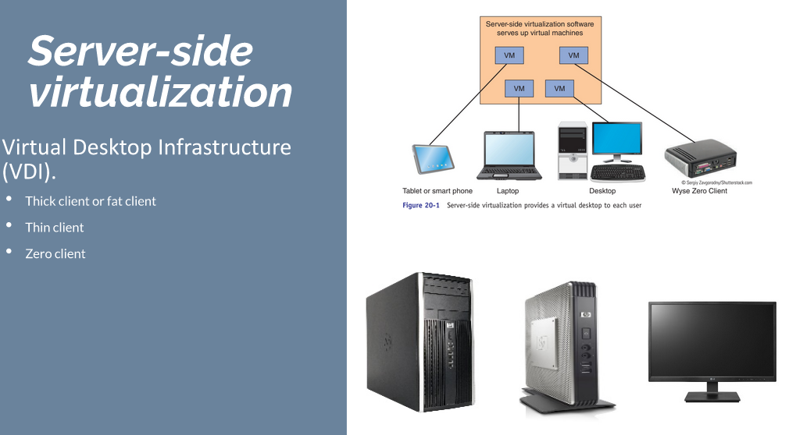
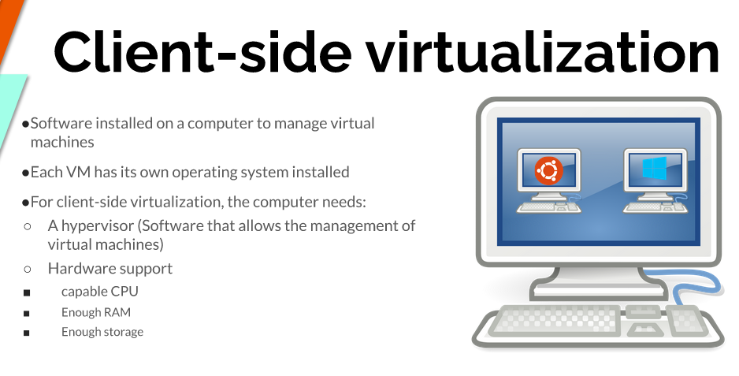
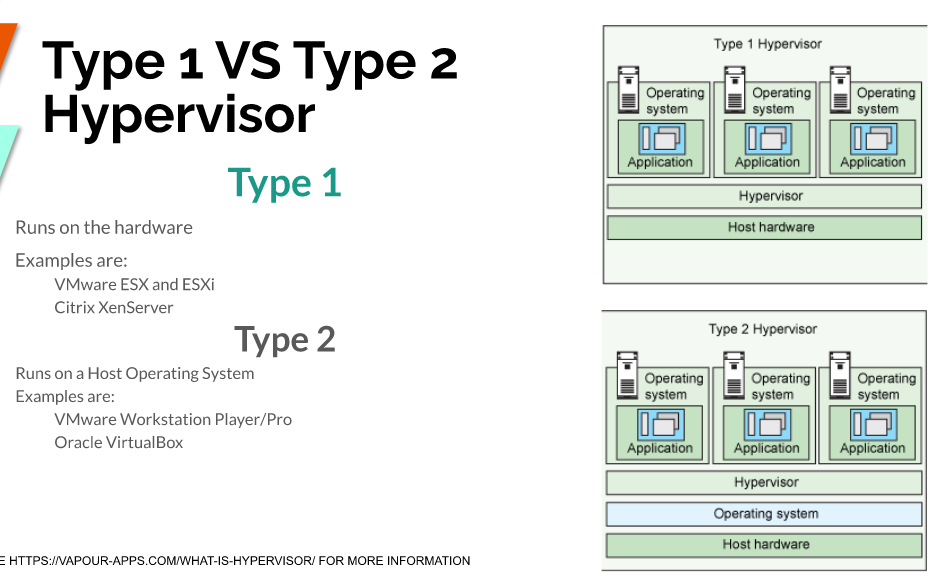
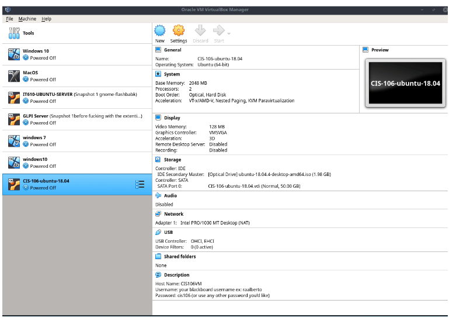
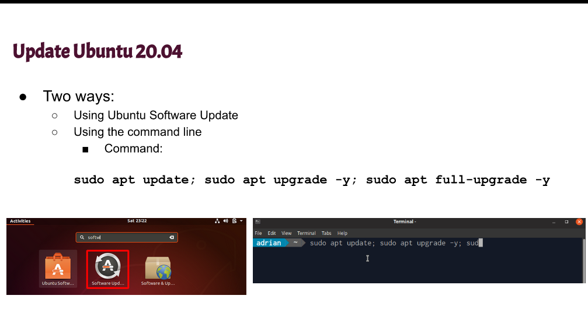
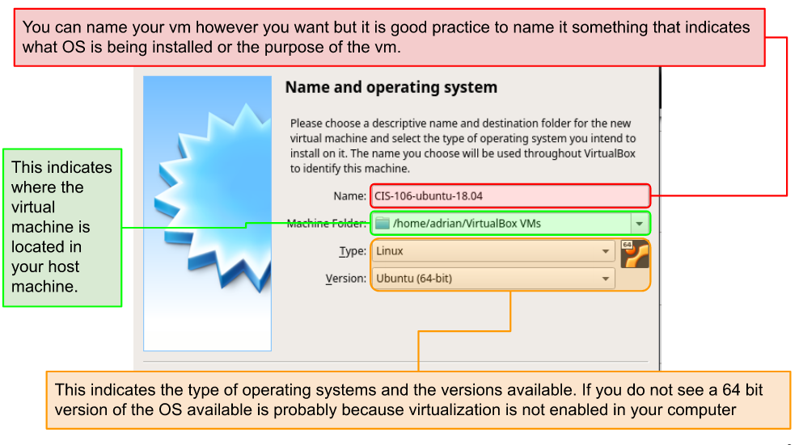
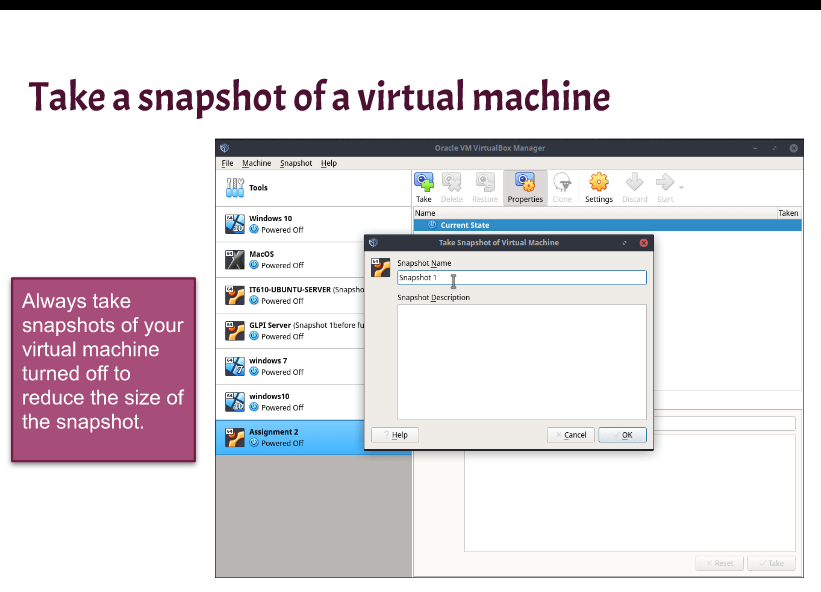
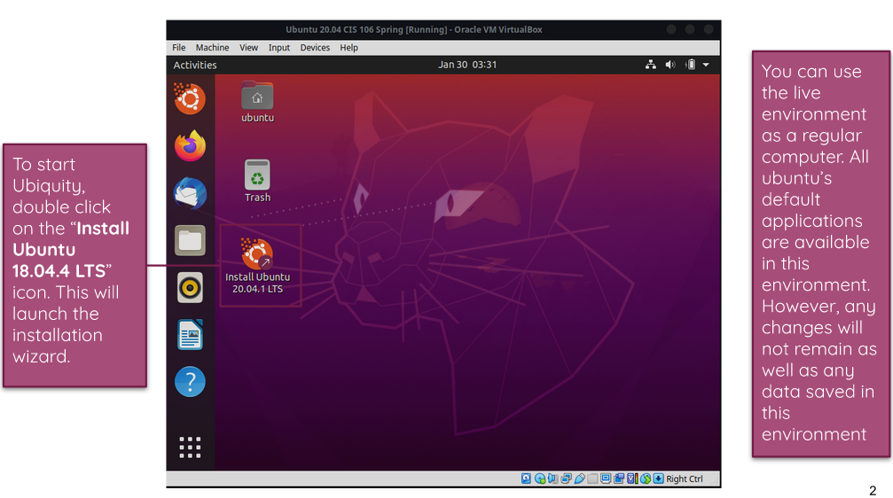

```
Name: Fiorella Alarcon
Semester: Fall 22
Course: cis106
```

# Week Report 2

## The basics of Virtualization

1. **What is virtualization**
Replication of hardware to simulate a virtual machine inside a physical machine

2. **Types of virtualization**

- Server Side Virtualization
Virtual Desktop infrastructure(VDI)


- Client-side Virtualization
Software installed on a computer to manage virtual machines with its own operating system installed. A hypervisor and certain hardware requirements are needed. 




## Installing Ubuntu in Virtualization
- Settings
  
- Update 
  
- Name and Operating System 
  
- Snapshot
  
- Live
  