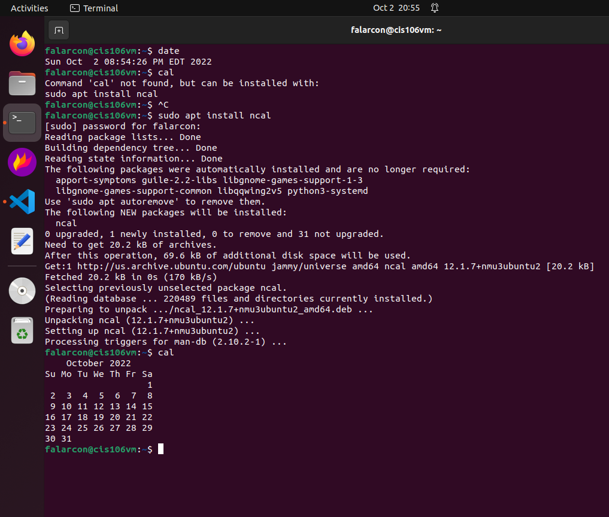
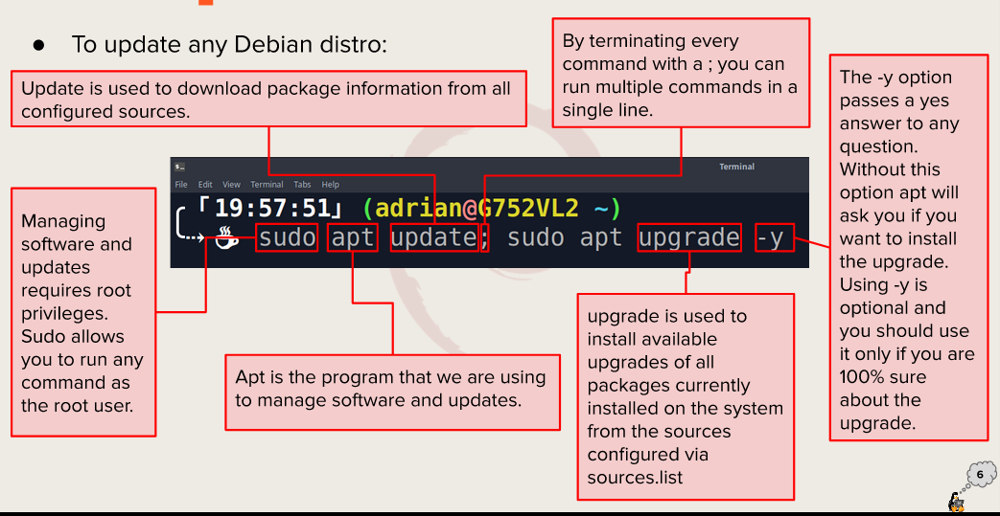
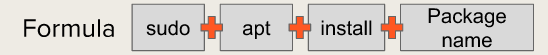
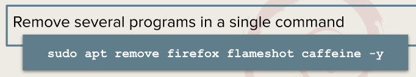
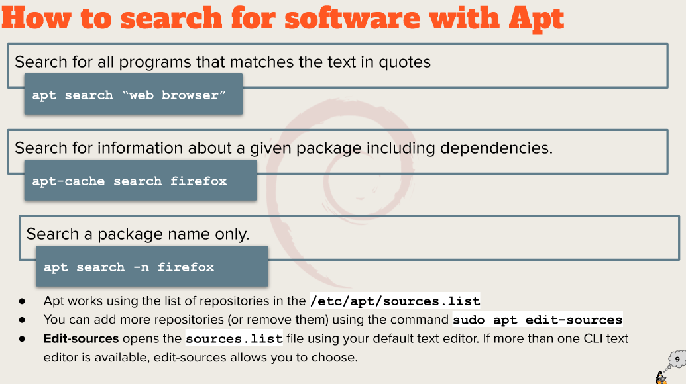

```
Name: Fiorella Alarcon
Semester: Fall 22
Course: cis106
```

# Week Report 3

a. **Exploring Desktop Environments**

- Different desktop environments
  - GNOME
  - KDE
  - BUDGIE
  - PANTHEON
  - Fluxbox

- **GUI**: (graphical user interface) a set of programs that allows a user to interact with the computer system by using icons, windows, and other visual elements.
- **DE**: (Desktop environment) an implementation of the desktop metaphor made of a bundle of programs running on top of a computer operating system. Shares a common GUI called graphical shell.

- Elements of a Desktop Environment:
  - Desktop Settings
  - Display Manager
  - File Manager
  - Icons
  - Favorites Bar
  - Launcher
  - Menus
  - Panels
  - System tray
  - Widgets
  - Window Manager

b. **The bash Shell**

- What is a shell?
  - a program that provides interactive access to the linux system. Runs as a regular program and starts whenever a user logs into a terminal.

- Different shells:
  - Tcsh Shell
  - Csh Shell
  - Ksh Shell
  - Zsh Shell
  - Fish Shell

- Bash shortcuts
    - Ctrl + A (go to start of the command line)
    - Ctrl + E (go to end of the command line)
    - Ctrl + K (delete the cursor to the end of the command line)
    - Ctrl + U (delete from cursor to the start of the command line)
    - Ctrl + W (delete from cursor to the start of word)
  
- Basic commands and their usage:
  - date: displays the current data and time
  - cal: displays a calendar of the current month
  
  - df: displays the current amount of free spae on our disk drives
  - free: displays the amount of free memory
  - uname:displays information about your system
  - clear: clears the screen

c. **Managing Software**
- Command for updating ubuntu
  

- Command for installing software
  

- Command for removing software
  

- Command for searching for software
  

- Definitions
  - Package: archives that contain binaries of software, configuration files, and information about dependencies.
  - Library: reusable code that can be used by more than one function or program.
  - Repository: a large collection of software available for download.


