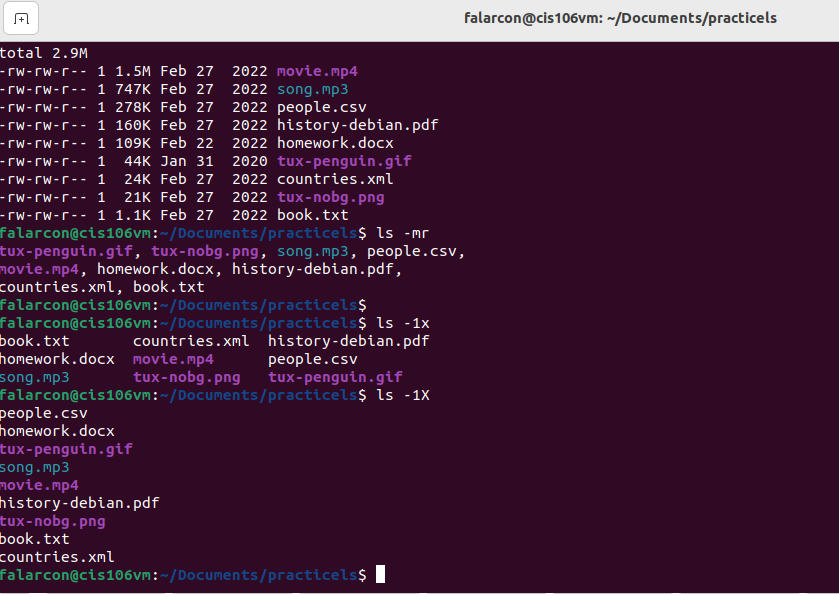

```
Name: Fiorella Alarcon
Semester: Fall 22
Course: cis106
```

# Week Report 4

## Practice
 
 
 
 

 ## The Filesystem (Some Important Directories)

| Directory | Data Stored in Directory                                                                                                        |
| --------- | ------------------------------------------------------------------------------------------------------------------------------- |
| bin       | essential commands                                                                                                              |
| dev       | device files                                                                                                                    |
| etc       | system configuration files                                                                                                      |
| home      | user home directories                                                                                                           |
| media     | mount point for removable media, sch as DVDs and floppy disks                                                                   |
| opt       | add-on software packages                                                                                                        |
| proc      | kernel information, process control, system hardware information                                                                |
| srv       | information relating to services that run on the system                                                                         |
| usr       | software not essential for system operation, such as applications                                                               |
| var       | dedicated to variable data, such as logs, databases, websites, and temporary spool files that persist from one boot to the next |

## Commands to navigate the filesystem 

| command | What it does                                                        | Syntax                                | Example            |
| ------- | ------------------------------------------------------------------- | ------------------------------------- | ------------------ |
| pwd     | prints current working directory                                    | `pwd`                                 | ` pwd `            |
| cd      | changes the current working directory                               | `cd` + `destination`                  | `cd Downloads`     |
| ls      | lists the content of a given directory or the file/directory itself | `ls` + `option` + `directory to list` | `ls -a ~/Pictures` |

## Key Terms

*Definitions of the following terms*

* **File system**: the way the files are stored and organized to simplify access to data.
* **Current directory**: the directory you are at the moment 
* **parent directory**: backwards to the previous directory
* **the difference between your home directory and the home directory**
  * your home directory is your current working directory when you open a terminal emulator. Every user in system has a home directory and full permissions of their own. The home directory is accessed through root user only.
* **pathname**: indicates the location of the file in the filesystem (like an address)
* **relative path**: the location of a file stating from the current working directory or a directory that is located inside the current working directory
* **absolute path**: the location of a file starting at the root of the file system
* **The commands are used for navigating the filesystem**
  * pwd
  * cd
  * ls


