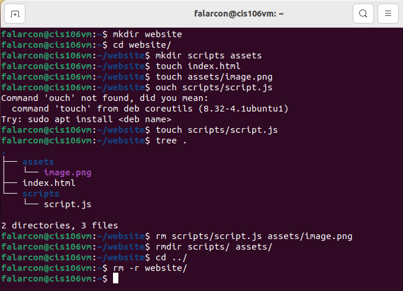
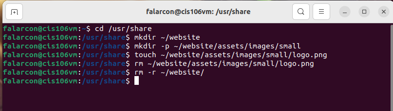
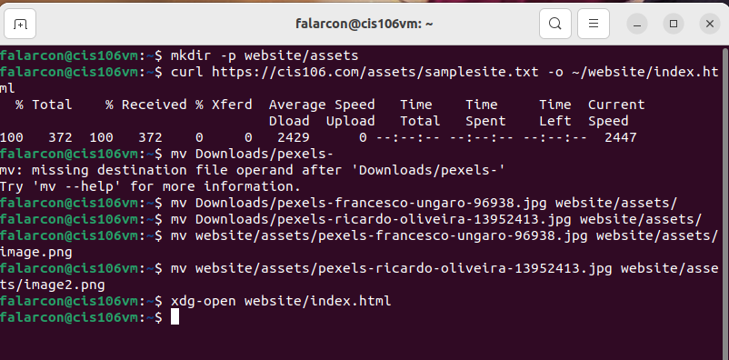
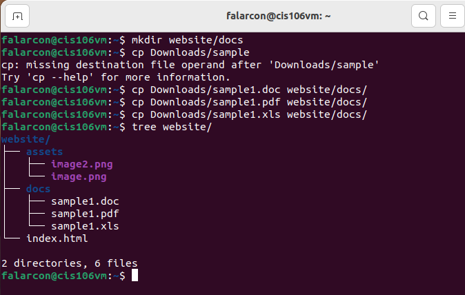

```
Name: Fiorella Alarcon
Semester: Fall 22
Course: cis106
```

# Week Report 5

## What are Command Options?
Options modify or enhance the commands behavior.

## What are Command Arguments?
Arguments are the items open which the command acts on.

## Which command is used for creating directories? Provide at least 3 examples.
The mkdir command is used for creating directories. To create a directory use this formula: `mkdir + directory name`
### Examples:
* Create a directory in the present working directory 
  * `mkdir + wallpapers`
* Create a directory in a different directory sing relative path
  * `mkdir wallpapers/ocean`
* Create a directory in a different directory using absolute path
  * `mkdir ~/wallpapers/forest`

## What does the touch command do? Provide at least 3 examples.
The touch command is used for creating files.
### Examples
* To create a filed called list
  * `touch list`
* To create several files
  * `touch list_of_cars.txt script/py names.csv`
* To create a file sing absolute path
  * `touch ~/Downloads/games.txt` 

## How do you remove a file? Provide an example.
The rm command removes files.
### Example
* remove a file
  * `rm list`

## How do you remove a directory and can you remove non-empty directories in Linux? Provide an example
To remove a directory use rm with the -r option. To remove empty directories use the rmdir command.
### Examples
* remove an empty directory
  * `rmdir Downloads/games`
* remove a non-empty directory
  * `rm -r Downloads/games` 

## Explain the mv and cp command. Provide at least 2 examples of each
The mv command moves and renames directories. The formula is `mv + source + destination`. For renaming files/directories the formula is `mv + file/directory to rename + new name`
The cp command copies files/directories from a source to a destination. The formula is `cp + files to copy + destination`. To copy directories you must use the -r option `cp -r + directory to copy + destination`.
### Examples
* To move a file from a directory to another using relative path
  * `mv Downloads/homework.pdf Documents/`
* To rename a file 
  * `mv homework.docx cis106homework.docx`
* To copy a file
  * `cp Downloads/wallpapers.zip Pictures/`
* To copy a directory with absolute path
  * `cp -r ~/Downloads/wallpapers ~/Pictures/`

## Practice

* Practice 1
<br>

* Practice 2
)<br>

* Practice 3
<br>

* Practice 4 
<br>


