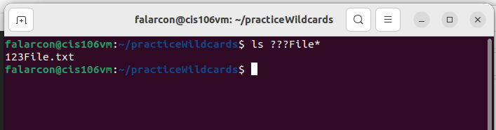
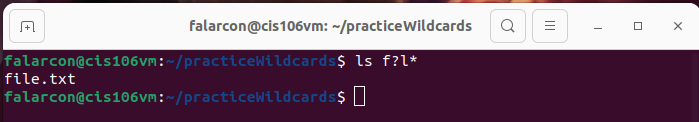
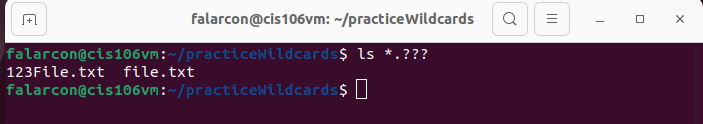
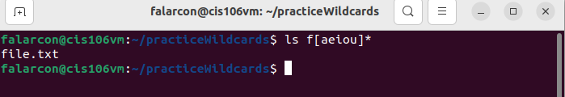
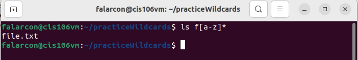
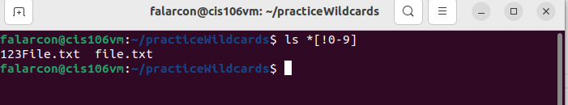
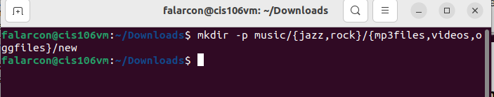
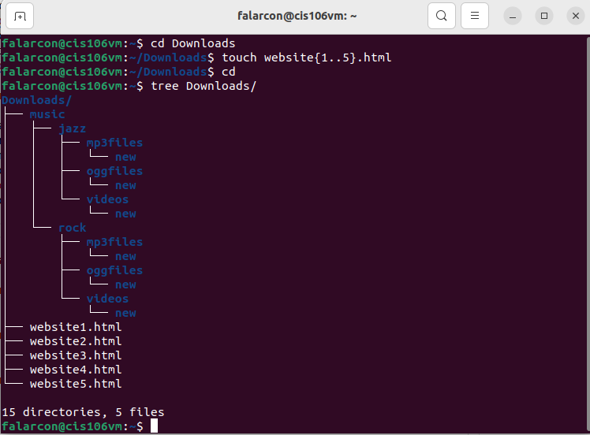
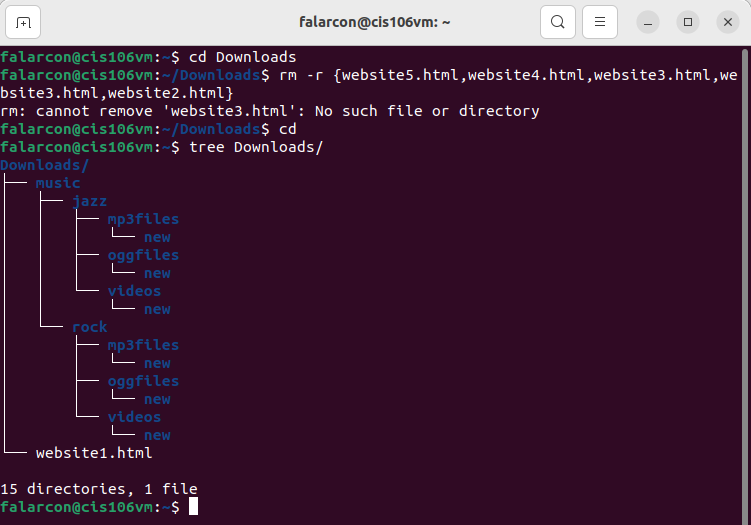
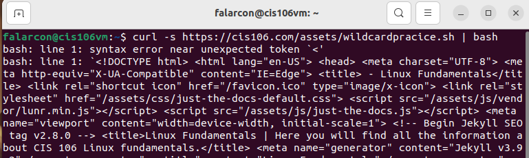

```
Name: Fiorella Alarcon
Semester: Fall 22
Course: cis106
```

# Week Report 6

## Wildcards

### * Wildcard 
The * wildcard matches from 0 to any number of characters.
* Examples:
  * List all the text file in a directory
    * `ls *.txt`
  * List all the files that start with the word file 
    * `ls file`
  * Copy all the mp4 files 
    * `cp Downloads/*.mp4 -/Videos/Movies/`

### ? Wildcard
The ? wildcard matches a single character.
* Examples:
  * list all the files that have 3 characters and are followed by the word file in the name

  * list all the files that a single character between letter f and l

  * list all the files that a have a 3 letter extension


### [] Wildcard
The [] wildcard ach a single character in a range. Uses the exclamation mark to reverse the match.
* Examples: 
  * to match all files that have a vowel after letter f 

  * to match all files that have a range of letters after f: 

  * to match all the files whose name does not have a number in their file name: 


### Brace Expansion
Brace expansion is not a wildcard but another feature of bash that allows you to generate arbitrary strings to use with commands.
* Examples
  * To create a whole directory structure in a single command:

  * To create a N number of files

  * to remove multiple files in a single directory


## Practice

### Practice 
Practice file error downloading.



